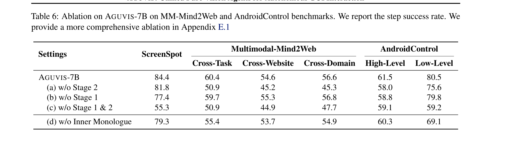
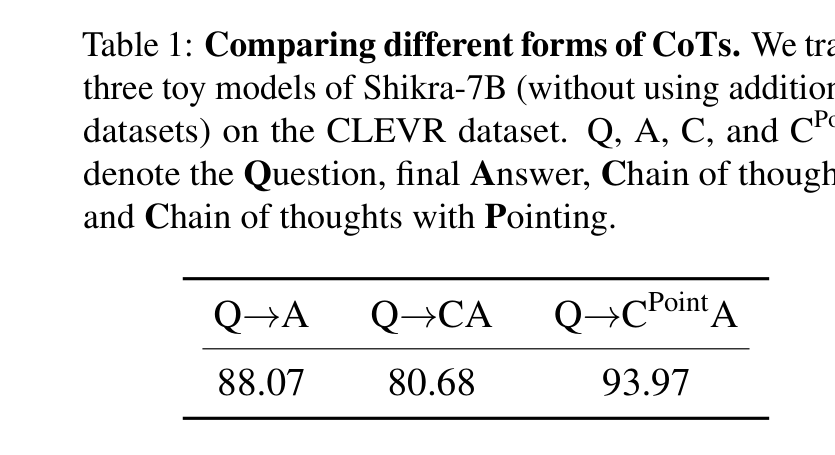
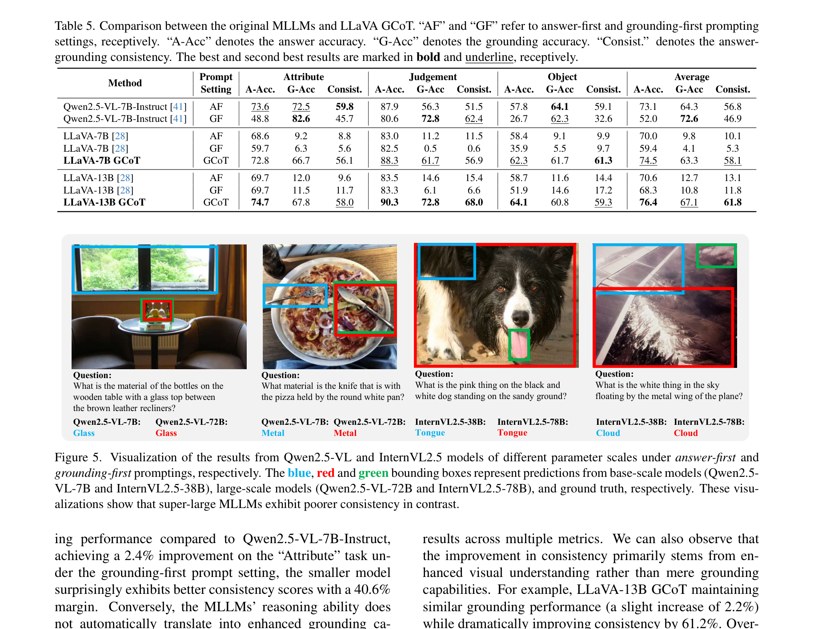

# Nguồn của từng con số ở slide "Vì sao thiết kế đúng kiểu này"

> Dùng khi thầy hỏi "số này lấy ở đâu". Bốn bảng dưới đây cắt thẳng từ PDF gốc, tải lại ngày 5/8 và đối chiếu lại từng ô.
> **Điều phải nói trước nếu bị hỏi kỹ:** ba trong bốn con số là **hiệu giữa hai dòng trong bảng của họ**, không phải số họ in sẵn. Đây là cách trình bày ablation thông thường, nhưng cứ khai rõ để không bị bắt bẻ.

| Số dùng trên slide | Nguồn | In sẵn trong bài? |
|---|---|---|
| Aguvis tụt 11,4 | Table 6, hiệu hai dòng: 80,5 − 69,1 | không, tự trừ |
| Shikra tụt 7,4 / tăng 5,9 | Table 1, hiệu với mốc: 80,68 − 88,07 và 93,97 − 88,07 | không, tự trừ |
| GCoT tăng 4,5 / 5,8 | Table 5, hiệu với dòng AF: 74,5 − 70,0 và 76,4 − 70,6 | không, tự trừ |
| CogCoM tăng 6,6 | Table 4, bài **in thẳng** "↑6.6" | có |

---

## 1. Aguvis (ICML 2025) — arXiv 2412.04454, Table 6, trang 7

Dòng gốc `AGUVIS-7B` so với dòng `(d) w/o Inner Monologue`, cột **AndroidControl Low-Level**: **80,5 → 69,1**, tức tụt **11,4** điểm.

Hai cột còn lại cũng phải trình cho đủ, vì chúng mới là thứ chứng minh hiệu ứng dồn đúng chỗ:
- AndroidControl High-Level: 61,5 → 60,3, chỉ tụt **1,2**
- ScreenSpot: 84,4 → 79,3, tụt **5,1**

**Nói gì khi trình:** đây là bài duy nhất trong bảng chạy trên **chính bộ dữ liệu AndroidControl** mà luận văn dùng, và bỏ tầng trung gian đi thì hỏng nặng nhất đúng ở mức từng-bước. Nhưng họ đo độ đúng thao tác, không đo chất lượng câu — nên chỉ mượn để nói *chiều*, không mượn làm dự báo.

---

## 2. Shikra — arXiv 2306.15195, Table 1, trang 6

Ba mô hình nhỏ, cùng dữ liệu, chỉ khác dạng bước trung gian:

| Cách huấn luyện | Điểm | Chênh so với mốc |
|---|---|---|
| Q→A (không có bước trung gian) — mốc | 88,07 | — |
| Q→CA (bước trung gian là văn xuôi) | 80,68 | **−7,39** |
| Q→C^Point A (bước trung gian có toạ độ) | 93,97 | **+5,90** |

**Nói gì khi trình:** đây là cặp số quyết định thiết kế — cùng một mô hình, cùng một bài kiểm, chỉ đổi dạng bước trung gian mà đảo dấu. Đó là lý do dòng khai báo bắt buộc có ô toạ độ.

**Điểm yếu phải tự khai:** ngay dòng chú thích của bảng ghi rõ họ dùng *"three toy models of Shikra-7B (without using additional datasets) on the CLEVR dataset"* — mô hình thí nghiệm nhỏ, chưa qua tiền huấn luyện, chạy trên bộ ảnh hình khối nhân tạo. Đây là bằng chứng yếu nhất trong bảng, nói trước thì thành điểm cộng.

---

## 3. GCoT — arXiv 2503.12799 (bản thảo), Table 5, trang 7

Cột **Average → A-Acc** (độ đúng câu trả lời, trung bình ba nhóm câu hỏi):

| Mô hình | Cách chạy | A-Acc | Chênh |
|---|---|---|---|
| LLaVA-7B | AF (trả lời trước) | 70,0 | — |
| LLaVA-7B GCoT | huấn luyện định-vị-trước | 74,5 | **+4,5** |
| LLaVA-13B | AF | 70,6 | — |
| LLaVA-13B GCoT | huấn luyện định-vị-trước | 76,4 | **+5,8** |

**Đây là bài hay bị hiểu ngược, nên nắm cho chắc:**
- Con số **âm** hay được trích (−42,8 hoặc 45,4) là ở chế độ **ra lệnh cho mô hình chưa huấn luyện** — nằm ở Table 3 và Table 4, không phải Table 5. Riêng "−42,8" là số tự trừ hai bảng đó, bài không in; bài viết thành chữ là 45,4.
- Khi **huấn luyện hẳn** theo thứ tự định-vị-trước thì điểm **tăng**, và tăng cả ba cột A-Acc, G-Acc, Consist. — không đánh đổi.
- **Điểm yếu của họ, chủ động khai để thành lợi thế:** họ thay bộ dữ liệu dạy bằng dữ liệu cùng phân bố với bộ đề rồi huấn luyện lại từ đầu, nên +4,5/+5,8 trộn hai nguyên nhân (thứ tự sinh, và quen đề) mà bài không có thí nghiệm nào tách ra. Phép so bản-thường-với-bản-khai-báo của luận văn dùng **cùng một bộ dữ liệu, chỉ đổi đích sinh**, nên tách được. Chỗ này luận văn chặt hơn tiền lệ.

---

## 4. CogCoM (ICLR 2025) — arXiv 2402.04236, Table 4, trang 10

Bỏ 70K dữ liệu chuỗi thao tác trung gian ra khỏi quá trình huấn luyện rồi so:

Bài in thẳng mức tăng: TextVQA **↑6,6** · MMVet ↑0,2 · MathVista ↑0,9.

**Nói gì khi trình:** phải trích cả cụm ba số chứ đừng chỉ khoe 6,6 — hai bài kiểm còn lại gần như đứng yên. Hiệu ứng chỉ nổi ở bài đòi đọc chữ trong ảnh, tức là đúng loại việc cần định vị trước, và đó mới là điều đáng nói.

---

## Câu chốt nếu thầy vặn "mỗi bài đo một thước, so kiểu gì?"

Đúng ạ, bốn bài dùng bốn thước khác nhau nên không so thẳng con số với nhau được. Em chỉ dùng chúng cho hai việc:

1. **Chiều của hiệu ứng** — bỏ bước trung gian đi thì hỏng, thêm vào thì tốt lên.
2. **Dạng bước trung gian nào mới có tác dụng** — cặp Shikra cho thấy văn xuôi thì âm, có toạ độ thì dương.

Còn hiệu ứng trên đề tài của em lớn bao nhiêu thì em phải tự đo, không mượn số của ai.

---

*File PDF gốc của bốn bài lưu ở `report/paper_figures/`. Ảnh bảng cắt bằng `PyMuPDF`, không chỉnh sửa nội dung.*
