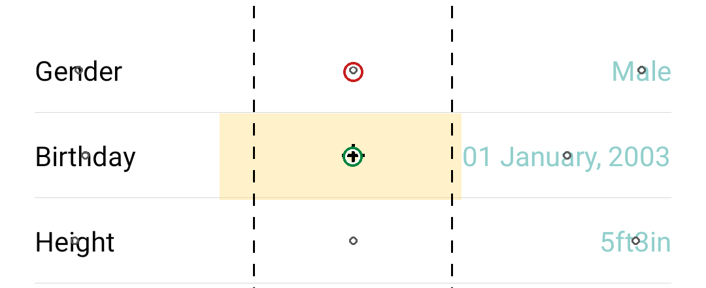

# Bản trình bày với thầy — 9/9/2026

> Đi theo đúng mạch của bộ slide bảo vệ `slides/LUAN_VAN_SLIDE_BAOCAO.pptx`
> (29 slide chính, 15 slide dự phòng, lời nói 23 phút 45 giây).
> Bản này thay `report/111` ngày 12/8, vì bộ slide hồi đó mới có 27 slide và chưa có
> chặng hai lẫn chặng ba.
> Mọi con số trong đây đều là số đo trên tập kiểm, không có số ước lượng.

## Ba điều em xin ý kiến thầy

Thứ nhất là **có nên chi lượt máy cuối cùng hay không**. Kế hoạch còn đúng một lượt huấn luyện trên máy A100, kéo dài từ hai mươi tới ba mươi bảy giờ, để mở phần thị giác của mô hình nền ra cho quá trình tinh chỉnh. Em đã ghi trước kỳ vọng của lượt này là khoảng ba mươi phần trăm khả năng vượt được ngưỡng phát hiện, và em xin trình bày căn cứ của con số đó ở phần cuối. Hướng còn lại là dừng ở kết quả hiện có và dành thời gian cho việc viết.

Thứ hai là **cách trình bày con số sáu mươi phần trăm trước hội đồng**. Điểm cao nhất của mô hình là 60,07, trong khi câu do người chú thích viết, chấm bằng đúng dụng cụ ấy, đạt 75,73. Em chọn cách in hai số cạnh nhau và nói rõ khoảng cách còn lại, thay vì chia tỉ lệ rồi nói mô hình đạt bao nhiêu phần trăm năng lực của người. Lý do em xin trình bày ở phần thước đo.

Thứ ba là **bài FAIR còn treo**. Bài đã gửi qua thư điện tử kèm bản PDF cho thầy Trần Văn Lăng để xin mở lại cổng nộp, nhưng hệ thống hội nghị vẫn ghi là chưa nhận được bản thảo và tới nay chưa có hồi âm. Em xin ý kiến thầy về việc có nên liên hệ lại hay không.

---

## 1. Bài toán

Đề tài sinh câu hướng dẫn sử dụng phần mềm từ ảnh chụp màn hình. Tình huống là một người đang mở một ứng dụng và không biết bấm gì tiếp. Đầu vào gồm ảnh màn hình đang mở và câu mục tiêu của người dùng, chẳng hạn "chia sẻ playlist này cho bạn tôi". Kết quả cần sinh là một câu tiếng Anh cho người ấy đọc, chẳng hạn "Tap the share icon at the top right of the screen".

Chỗ khác so với các nghiên cứu cùng mảng nằm ở kết quả đầu ra. Các mô hình tác tử giao diện hiện nay nhận cùng đầu vào như vậy nhưng sinh ra toạ độ để máy tự bấm. Luận văn này lấy câu chữ làm sản phẩm cuối, và câu là thứ duy nhất được đem chấm. Mô hình dùng là Qwen2.5-VL ba tỉ tham số, chạy được tại máy, vì ảnh màn hình là dữ liệu riêng tư của người dùng nên không nên gửi lên dịch vụ ngoài.

Đổi kết quả đầu ra như vậy kéo theo hai vấn đề. Vấn đề thứ nhất là không có cách chấm sẵn. Các thước so khớp chuỗi kết oan 97,5% số câu diễn đạt khác nhưng cùng nghĩa, còn thước dựa trên vector ngữ nghĩa chỉ đạt 0,336 khi đo khả năng phân biệt câu đúng với câu sai, tức là gần như đoán mò. Vấn đề thứ hai là dạng lỗi. Em đọc tay bốn mươi trường hợp thì thấy mô hình gần như không bịa ra nút không có trên màn hình; lỗi áp đảo là câu mơ hồ, kiểu gọi tên một nút mà trên màn có tới ba nút cùng tên như vậy.

## 2. Công trình liên quan

Có năm dòng công trình gần đề tài này, và em xin nêu rõ luận văn khác đi ở chỗ nào.

Dòng thứ nhất là các mô hình tác tử giao diện như SeeClick, OS-Atlas, Aguvis. Chúng sinh toạ độ cho máy tự bấm; luận văn lấy câu làm sản phẩm cuối và đem câu đi chấm.

Dòng thứ hai là chính bài gốc của bộ dữ liệu, AndroidControl ở NeurIPS 2024. Họ có câu do người chú thích viết, nhưng dùng câu ấy làm đầu vào cho mô hình. Luận văn dùng chính câu ấy làm đích cần sinh ra.

Dòng thứ ba là sinh biểu thức quy chiếu, có từ Mao năm 2016 và Yu năm 2017. Yêu cầu của dòng này là câu phải đủ để người nghe trỏ đúng vật. Luận văn đặt yêu cầu đó vào miền giao diện. Vì ý này đã có từ 2016 nên trong luận văn em không dùng chữ "đầu tiên".

Dòng thứ tư là Widget Captioning ở EMNLP 2020, sinh mô tả cho phần tử giao diện nhưng hàm mất mát chỉ là entropy chéo thuần. Luận văn đưa tính phân biệt vào thẳng mục tiêu huấn luyện.

Dòng thứ năm là Zhao và cộng sự ở EACL 2021, cho thấy BLEU và ROUGE không đo được chất lượng của hướng dẫn có định vị. Đây là căn cứ để luận văn không dùng nhóm thước đồng thuận.

## 3. Ba đóng góp và trạng thái thật của từng đóng góp

Đóng góp thứ nhất là **thước đo**, đã hoàn tất. Đây là phần em tự tin nhất.

Đóng góp thứ hai là **quy trình dựng dữ liệu và thành phần đề xuất trong mô hình**. Quy trình dựng dữ liệu đã hoàn tất. Thành phần đề xuất thì đã chạy, có số, nhưng mức chênh so với nhánh so sánh chưa vượt được ngưỡng phát hiện, nên em phải báo là chưa kết luận được.

Đóng góp thứ ba là **phân tích lỗi ở mức từng bước**, đã hoàn tất, và theo em đây là phần có giá trị nhất cho người làm tiếp, vì nó chỉ đúng chỗ phải tác động.

## 4. Dữ liệu

Bộ dữ liệu là AndroidControl của Google DeepMind, giấy phép CC0, ghép từ hai kho trên HuggingFace theo khoá gồm mã tập phim và mã bước. Tập dạy có 64.567 bước, tập kiểm có 6.958 bước, trong đó 4.463 bước là bước chạm và đây là phần được đem chấm.

Hai điều đáng nói về dữ liệu. Thứ nhất, toàn bộ nhãn mô tả phần tử được dựng bằng máy, hoàn toàn bằng luật, không thuê người dán nhãn. Thứ hai, cây trợ năng của Android tuy có trung vị 86 phần tử một màn nhưng chỉ 12,6% phần tử có tên gọi, đo trên 120 màn lấy ngẫu nhiên, nên phải trích chữ trên ảnh để bù vào, và phần trích chữ này phủ 100% số bước.

Mỗi bước chạm được gán một dòng mô tả gồm bốn ô: vai trò của phần tử, tên gọi, toạ độ đã chuẩn hoá, và dấu hiệu tách phần tử ấy khỏi những phần tử giống nó. Em có kiểm chất lượng bộ nhãn trên một mẫu 1.074 nhãn đọc tay.

## 5. Phương pháp

### 5.1. Thành phần đề xuất: mô tả phân biệt trước, phát ngôn sau

Mô hình được dạy sinh ra trước một dòng mô tả phần tử cần chạm, rồi mới sinh câu hướng dẫn. Dòng mô tả có bốn ô: vai trò của phần tử, tên gọi, toạ độ, và dấu hiệu tách nó khỏi những phần tử giống nó. Khi chấm thì chỉ lấy câu, phần mô tả bị cắt bỏ hoàn toàn. Nhánh chỉ sinh câu gọi là S1, nhánh sinh mô tả trước gọi là S2.

Ý đồ là buộc mô hình phải quyết định *nó đang nói về phần tử nào* trước khi viết câu, thay vì viết một câu nghe hợp lý mà không neo vào phần tử cụ thể nào.

### 5.2. Chặng hai: học theo ưu tiên trên cặp quy chiếu tối thiểu

**Học theo ưu tiên là gì.** Cách huấn luyện thông thường chỉ đưa cho mô hình một câu trả lời đúng và bảo nó bắt chước. Học theo ưu tiên thì đưa **hai** câu trả lời cùng lúc, nói rõ câu nào tốt hơn, và mô hình học cách nâng xác suất của vế tốt đồng thời hạ xác suất của vế kém. Thuật toán em dùng tên là ORPO.

**Cặp quy chiếu tối thiểu là gì.** Đây là chỗ em muốn trình bày kỹ. Nếu hai vế của một cặp khác nhau nhiều thứ cùng lúc thì mô hình học được rất nhiều điều lẫn lộn, và không ai biết nó thực sự học được điều gì. Nên em dựng cặp sao cho **hai vế giống hệt nhau ở mọi chỗ, chỉ khác đúng một ô trong dòng mô tả**. Một cặp thật lấy từ tệp huấn luyện:

| | nội dung |
|---|---|
| Câu nhắc | ảnh màn hình một ứng dụng đặt lịch, kèm mục tiêu của người dùng |
| **Vế được ưu tiên** | `<desc>checkbox | Friday | <point>748,449</point> | 1 of 8 elements of the same kind</desc>` rồi xuống dòng, rồi câu *"Select the weekdays like Monday to Friday"* |
| **Vế bị hạ** | `<desc>checkbox | Saturday | <point>873,449</point> | 1 of 8 elements of the same kind</desc>` rồi xuống dòng, rồi câu *"Select the weekdays like Monday to Friday"* |

Hai vế trùng nhau từng ký tự ở phần câu, trùng cả vai trò *checkbox* lẫn dấu hiệu phân biệt. Khác nhau đúng hai chỗ: tên gọi *Friday* so với *Saturday*, và toạ độ đi kèm.

**Vì sao phải làm vậy.** Trong lúc huấn luyện, mô hình được điều chỉnh theo hướng làm tăng phần chênh lệch giữa hai vế. Vì hai vế chỉ khác nhau ở ô mô tả, toàn bộ phần điều chỉnh ấy dồn vào đúng việc **chọn phần tử nào để nói tới**, không rơi vào việc học viết câu cho hay hơn hay đổi văn phong. Nếu vế bị hạ có câu khác đi, mô hình sẽ vừa học chọn phần tử vừa học tránh lối viết đó, và khi có kết quả thì không tách được phần nào là phần nào.

Tập cặp có 22.854 cặp như vậy. Nhánh huấn luyện theo cách này đặt tên là **MIN-DESC**.

**Nhánh so sánh CE2, và vì sao bắt buộc phải có.** MIN-DESC được học tiếp từ S2, tức là nó được huấn luyện thêm một lượt nữa. Nếu chỉ so MIN-DESC với S2 thì có một cách giải thích khác không loại trừ được: có thể mô hình khá lên chỉ vì được học thêm, chứ không phải vì cách học theo ưu tiên.

Nên em dựng thêm nhánh **CE2**: cũng xuất phát từ S2, cũng học thêm **đúng bấy nhiêu bước cập nhật, trên đúng bấy nhiêu dữ liệu**, nhưng bằng cách thông thường, chỉ bắt chước vế được ưu tiên chứ không có vế bị hạ. Hiệu số giữa MIN-DESC và CE2 vì thế là phần công của riêng cách học theo ưu tiên.

Kết quả của phép tách công này em xin nói thẳng vì nó không thuận lợi: từ S2 lên CE2 được **2,24 điểm**, còn từ CE2 lên MIN-DESC chỉ thêm **0,63 điểm**. Nghĩa là 78% mức tăng thuộc về việc học thêm, chỉ 22% thuộc về thành phần em đề xuất. Không có nhánh CE2 thì con số đem đi báo cáo đã là 2,87 điểm, và đó sẽ là một con số bị thổi phồng.

### 5.3. Chặng ba: học tăng cường thưởng cho ô toạ độ

**Vì sao chuyển sang cách khác.** Phân tích ở phần sau cho thấy điểm nghẽn nằm ở chỗ mô hình nhìn sai phần tử. Ô toạ độ trong dòng mô tả chính là chỗ mô hình khai ra nó đang nhìn vào đâu, nên can thiệp thẳng vào ô ấy là hướng gần điểm nghẽn nhất.

**Cách làm.** Với mỗi câu nhắc, mô hình tự sinh ra bốn phương án khác nhau. Mỗi phương án được chấm một điểm thưởng. Phương án nào được thưởng cao hơn mức trung bình của nhóm thì được đẩy lên, thấp hơn thì bị kéo xuống. Thuật toán tên là GRPO. Lượt chạy gồm 500 lần cập nhật trên 2.000 câu nhắc, tất cả lấy từ tập dạy.

**Điểm thưởng gồm ba phần**, tổng cao nhất là 1,3:

| phần thưởng | điều kiện | mức |
|---|---|---|
| Toạ độ đúng | ô `<point>` lệch không quá 140 đơn vị trên lưới 1000, theo cả hai chiều, so với phần tử đúng | **1,0** |
| Đúng khuôn dạng | sinh đúng một khối mô tả có đủ bốn ô, rồi xuống dòng, rồi một câu từ 2 tới 40 từ | 0,2 |
| Tên gọi có mặt trong câu | ít nhất một từ trong ô tên xuất hiện lại trong câu hướng dẫn | 0,1 |

**Điểm đáng nói nhất về thiết kế này là chỗ không có gì.** Trong cả ba phần thưởng, **không có mô hình định vị nào tham gia**. Điểm thưởng chỉ so ô toạ độ mà mô hình tự khai với toạ độ ghi trong dữ liệu, một phép so số học thuần tuý. Nếu em cho UGround vào phần thưởng thì mô hình sẽ học cách làm vừa lòng đúng cái máy sẽ chấm nó, và khi ấy điểm cao lên cũng không chứng minh được điều gì. Giữ UGround hoàn toàn ở ngoài quá trình huấn luyện thì thước vẫn còn là một phép thử độc lập.

Kết quả của chặng ba em trình bày ở phần 7, và có một chỗ bất ngờ đáng để thầy xem.

## 6. Thước đo

### 6.1. Ý tưởng

Thước gọi là **executability**, và nó hỏi đúng một câu: đưa câu do mô hình sinh cho một bên thứ ba chưa hề thấy đáp án, bên ấy đọc câu rồi bấm, thì có bấm đúng nút hay không. Bên thứ ba ở đây là **UGround**, một mô hình định vị giao diện độc lập, không liên quan tới mô hình đang được chấm và không được cho biết phần tử đúng là phần tử nào.

Cách hỏi như vậy tránh được cái bẫy của các thước so khớp chữ. Một câu diễn đạt khác hẳn câu mẫu nhưng vẫn chỉ đúng nút thì thước này cho đạt, còn thước so khớp chữ thì đánh trượt.

### 6.2. Chấm một bước diễn ra thế nào

Mỗi bước chạm trong tập kiểm được chấm qua bốn khâu, và chỉ đạt khi qua trọn cả bốn.

**Khâu 1.** Lấy câu mô hình sinh cho bước ấy, cắt bỏ phần mô tả phần tử nếu có, chỉ giữ câu hướng dẫn. Đây là điều quan trọng: phần mô tả mà thành phần đề xuất sinh ra không bao giờ được đem chấm, nó chỉ là bước trung gian.

**Khâu 2.** Kiểm loại thao tác. Câu phải nói đúng rằng đây là thao tác chạm. Câu kiểu "vuốt lên" hay "bấm nút quay lại" ở một bước lẽ ra phải chạm thì trượt ngay từ khâu này.

**Khâu 3.** Đưa ảnh màn hình của bước ấy cùng câu vừa cắt cho UGround. UGround trả về một điểm trên màn hình, là chỗ mà nó cho rằng câu đang bảo bấm vào.

**Khâu 4.** So điểm ấy với phần tử đúng, bằng hai điều kiện phải thoả cùng lúc:

- **Điều kiện dung sai.** Điểm trỏ phải nằm trong khung ±14% bề ngang và ±14% bề dọc quanh
tâm phần tử đúng. Trên màn 1080×2400 điểm ảnh thì đó là 151 điểm ảnh theo chiều ngang và 336 điểm ảnh theo chiều dọc.
- **Điều kiện ô Voronoi.** Trong tất cả các phần tử bấm được của màn hình ấy, phần tử đúng
phải là phần tử gần điểm trỏ nhất. Nói cách khác, nếu có một nút khác nằm gần chỗ bấm hơn thì coi như người đọc đã bấm nhầm sang nút kia.

### 6.3. Ba ví dụ thật, lấy từ tệp chấm

Ba bước dưới đây lấy nguyên từ tệp kết quả chấm của nhánh S1, không phải ví dụ dựng lại. Màn hình của cả ba đều là 1080×2400, nên dung sai là 151 điểm ảnh ngang và 336 dọc.

**Ví dụ 1, đạt trọn.** Ứng dụng Skyscanner, bước 1.

| | |
|---|---|
| Câu mô hình sinh | *"Click on the Flights icon at the top of the screen."* |
| Câu chuẩn của người | *"Open the Flights Tab."* |
| UGround trỏ lệch so với phần tử đúng | 2 điểm ảnh ngang, 9 điểm ảnh dọc |
| Kết quả | **đạt** |

Chỗ đáng nói là hai câu diễn đạt khác hẳn nhau, một câu nói "biểu tượng Flights ở phía trên màn hình", câu kia nói "mở thẻ Flights". Thước so khớp chữ sẽ đánh trượt câu của mô hình, còn thước này cho đạt, vì cái nó hỏi là bấm có đúng chỗ hay không.

**Ví dụ 2, dung sai đạt nhưng điều kiện Voronoi loại.** Một màn danh bạ có 97 phần tử bấm được.

| | |
|---|---|
| Câu mô hình sinh | *"Click on the Smith contact."* |
| Câu chuẩn của người | *"Click on the Smith's name."* |
| UGround trỏ lệch so với phần tử đúng | 124 điểm ảnh ngang, 2 điểm ảnh dọc |
| Điều kiện dung sai | đạt, vì 124 nhỏ hơn 151 |
| Điều kiện Voronoi | **không đạt**, vì trên màn có phần tử khác nằm gần chỗ bấm hơn |
| Kết quả | **trượt** |

Đây chính là lý do phải có điều kiện thứ hai. Nếu chỉ dùng dung sai thì bước này được tính là đạt, trong khi thực tế người đọc câu ấy sẽ bấm trúng một phần tử khác.

**Ví dụ 3, câu mơ hồ nên trượt.** Ứng dụng Vimeo, một màn danh sách video.

| | |
|---|---|
| Câu mô hình sinh | *"Open the second video from the list."* |
| Câu chuẩn của người | *"click on the Dimitri vegas song"* |
| UGround trỏ lệch so với phần tử đúng | 309 điểm ảnh ngang |
| Kết quả | **trượt** |

Câu của mô hình không sai về mặt ngữ pháp và cũng không bịa ra nút không có thật. Cái sai là nó đếm thứ tự thay vì gọi tên, nên bên đọc câu không xác định được video nào. Đây đúng là dạng lỗi áp đảo mà em nêu ở phần đầu, và cũng là lý do thành phần đề xuất được thiết kế để bắt mô hình gọi tên phần tử trước khi viết câu.

### 6.4. Vì sao chọn luật này chứ không phải luật lỏng hơn

Luật xác định trúng được chọn theo **sàn** mà nó đạt được, không phải theo điểm mà nó cho mô hình. Cách kiểm là bơm nhiễu vào điểm trỏ rồi xem luật còn phân biệt được đúng với sai hay không, làm trên 250 bước rút ngẫu nhiên, mỗi bước bơm bốn lần theo bốn góc, tổng cộng 1.000 lượt.

| tình huống bơm | luật chỉ có dung sai | **luật dung sai kèm Voronoi** |
|---|---|---|
| lệch 3% bề ngang | 100,0% cho qua | 99,7% cho qua |
| lệch 8% bề ngang | 100,0% cho qua | 74,4% cho qua |
| **trỏ hẳn vào tâm một phần tử khác** | **84,3% vẫn cho qua** | **2,8% cho qua** |

Hàng cuối là hàng quyết định. Luật chỉ có dung sai vẫn cho qua 84% số ca trỏ nhầm hẳn sang nút khác, tức là nó gần như không phân biệt được đúng với sai, dải sử dụng được chỉ khoảng 16 điểm. Luật kèm Voronoi giữ được 99,7% khi nhiễu nhỏ mà chỉ cho qua 2,8% khi trỏ nhầm, dải sử dụng được khoảng 97 điểm. Vì vậy luật kèm Voronoi được chọn làm thước chính, còn luật dung sai vẫn được báo kèm cho minh bạch.

### 6.5. Trần, sàn và ngưỡng phát hiện

Thước có sáu khối kiểm chứng, và ba khối em muốn thầy lưu ý.

**Trần và sàn đều là số đo, không phải giả định.** Trần là điểm của chính câu do người chú
thích viết, chấm qua đúng dụng cụ ấy, được **75,73**. Cách đo rất đơn giản: thay câu của mô hình bằng câu của người rồi cho chạy lại toàn bộ đường chấm. Sàn đo bằng cách thay mọi câu bằng một câu rỗng nghĩa kiểu "hãy bấm vào nút", được **12,0**. Còn nếu thay bằng câu thật nhưng lấy của màn hình khác, tức câu đúng văn phong mà sai nội dung, thì chỉ được **6,1**, thấp hơn cả câu rỗng nghĩa. Điều này giết được lo ngại rằng thước chỉ đang chấm văn phong.

**Thước là hàm tất định.** Cùng một câu và cùng một ảnh thì luôn ra cùng một điểm trỏ. Em có
chạy lại bốn lượt độc lập với thứ tự và cách gom lô khác nhau, kết quả không có một bất đồng nào trên 1.625 phép so.

**Ngưỡng phát hiện.** Mức chênh nhỏ nhất phát hiện được, viết tắt là MDE, bằng **2,11 điểm**.
Con số này tính từ nhiễu giữa hai hạt giống ngẫu nhiên của cùng một cấu hình, tức là mức dao động thuần tuý do may rủi khi huấn luyện. Một can thiệp chỉ được gọi là có tác dụng khi vượt được mức ấy. Ngưỡng được chốt trước khi các nhánh của chặng hai và chặng ba được huấn luyện.

### 6.6. Một thước báo kèm: luật hộp phần tử của chính bộ dữ liệu

Ngoài thước chính, em còn báo kèm một luật thứ hai, lấy từ **Phụ lục D.3 của chính bài AndroidControl**, tức luật chấm gốc do nhóm làm ra bộ dữ liệu đặt: điểm dự đoán chỉ cần **nằm trong hộp bao của phần tử đúng** là tính trúng.

Khác biệt so với luật chính nằm ở chỗ dung sai. Luật chính đo bằng một cửa sổ cố định ±14% quanh tâm phần tử. Luật D.3 đo bằng chính hộp của phần tử, nên dung sai **co giãn theo cỡ phần tử**: nút nhỏ thì chặt hơn, nút to thì rộng hơn, và rộng đúng nghĩa vật lý, vì chạm chỗ nào trong nút cũng kích hoạt được. Theo chiều dọc, hộp thật có trung vị chỉ 5,2% chiều cao màn hình, tức chặt hơn cửa sổ ±14% tới năm lần.

| Nhánh | Luật chính (ô Voronoi) | **Luật D.3 (hộp phần tử)** |
|---|---|---|
| Câu chuẩn của người chú thích (trần) | 75,73 | **83,82** |
| Chặng ba, thưởng ô toạ độ | 60,07 | **67,04** |
| Chặng hai, MIN-DESC | 60,05 | 66,55 |
| S1, hạt giống 202 | 59,62 | 66,10 |
| CE2, nhánh so sánh | 59,42 | 66,03 |
| S1, hạt giống 101 | 59,11 | 65,49 |
| S2, sinh mô tả trước | 57,18 | 63,63 |
| Nhánh ứng viên | 56,13 | 62,38 |
| Mô hình gốc | 47,59 | 53,60 |

Hai điều làm em tin luật này không phải là nới lỏng cho dễ coi. Thứ nhất, **thứ tự tám nhánh không đổi một chỗ nào**. Thứ hai, và quan trọng hơn, **nó không kéo sàn lên**: trên cùng một lát đo, trần đi từ 74,88 lên 83,00, thêm 8,12 điểm, trong khi câu rỗng nghĩa chỉ đi từ 12,00 lên 14,12 và câu sai màn hình chỉ đi từ 6,12 lên 8,62. Kết quả là dải sử dụng được **rộng ra**, từ 62,88 lên 68,88 điểm. Để so sánh, luật chữ nhật lỏng kéo sàn của câu rỗng nghĩa lên tận 20,50, và đó chính là lý do luật ấy bị loại.

Điều em phải khai kèm là D.3 được tính **sau khi đã thấy mọi điểm số**, khác với luật chính vốn được cố định từ đầu. Vì vậy em chỉ trình nó như một thước báo kèm để người đọc định vị được kết quả, còn con số tiêu đề vẫn là con số của luật chính. Phép tính lại làm trực tiếp trên tệp kết quả thô nên không tốn thêm giờ máy nào.

Cuối cùng, thước này **chặt hơn quy ước của lĩnh vực**, vì nó thêm hẳn một tầng: câu phải đủ để một mô hình độc lập trỏ trúng. Vì vậy không so thẳng con số của luận văn với các bài dùng cách khớp toạ độ trực tiếp được, và trong luận văn em có nói rõ điều đó.

## 7. Kết quả

| Nhánh | Điểm thực thi | Khoảng tin cậy 95% |
|---|---|---|
| Câu chuẩn của người chú thích (trần) | **75,73** | [74,1 ; 77,3] |
| Mô hình gốc, chưa tinh chỉnh | 47,59 | [45,9 ; 49,3] |
| S1, chỉ sinh câu, hạt giống 101 | 59,11 | [57,3 ; 60,8] |
| S1, hạt giống 202 | 59,62 | [57,9 ; 61,3] |
| S2, sinh mô tả trước | 57,18 | [55,4 ; 58,9] |
| CE2, nhánh so sánh của chặng hai | 59,42 | [57,7 ; 61,1] |
| MIN-DESC, chặng hai | 60,05 | [58,3 ; 61,8] |
| **Chặng ba, thưởng ô toạ độ** | **60,07** | [58,3 ; 61,8] |

Điều đứng vững nhất là **tinh chỉnh đáng 11,52 điểm** so với mô hình gốc, lặp lại ở cả hai hạt giống, và đã đi qua sáu cách giải thích thay thế mà không đổ.

Điều em phải báo thẳng là **không can thiệp nào trong năm can thiệp đã đo vượt được ngưỡng 2,11 điểm**. Chặng hai hơn nhánh so sánh 0,63 điểm, hơn S1 0,95 điểm. Chặng ba hơn chặng hai đúng 0,02 điểm, nên hai nhánh ấy phải đọc là cùng một mức chứ không phải một nhánh thắng. Quy công cho rõ: từ S2 lên CE2 là 2,24 điểm và đó là công của việc học thêm, từ CE2 lên MIN-DESC là 0,63 điểm và đó mới là phần riêng của mục tiêu ưu tiên, tức 78% mức tăng thuộc về nhánh so sánh.

Riêng chặng ba có một điểm đáng kể về mặt phương pháp. Ở tầng mô tả, chặng ba tăng 2,56 điểm với p bằng 1,3 nhân mười mũ trừ tám, tức là chắc chắn có tác dụng. Nhưng ở đầu ra thì chỉ nhích 0,02 điểm. Trước khi chấm em có ghi lại một dự báo, lấy hệ số chuyển đổi đo được ở chặng hai để suy ra mức tăng đầu ra khoảng 1,10 điểm; dự báo ấy bị chính số đo bác bỏ. Lý do trực tiếp thì tìm ra được: trong 1.950 bước có ô mô tả thay đổi, có 1.300 bước, tức hai phần ba, mà câu ở đầu ra không đổi một ký tự, mà thước thì chỉ đọc câu.

## 8. Phân tích lỗi

Đây là phần em nghĩ có giá trị nhất, và cũng là phần trả lời cho câu hỏi vì sao các can thiệp đều dừng ở mức chênh nhỏ.

Chia 3.473 bước có tên tham chiếu theo việc dòng mô tả của chính mô hình đúng hay sai, thì thấy cơ chế không hỏng. Ở nhóm mô tả đúng, chiếm 60,6% số bước, chặng hai đạt 87,1 so với 78,3 của S1, tức hơn 8,83 điểm và vượt cả trần của nhóm ấy. Ở nhóm mô tả sai thì kém 11,12 điểm. Nghĩa là cơ chế đúng, nhưng bị chặn bởi độ chính xác của chính ô mô tả.

Đi sâu thêm một tầng thì tách được đường đi từ ảnh tới câu thành hai kênh đo riêng. Kênh thứ nhất là mô hình có nhìn đúng phần tử hay không, kênh thứ hai là có diễn đạt được hay không. Kết quả là **91% khoảng cách so với câu chuẩn dồn vào 29,9% số bước mà mô hình nhìn sai phần tử ngay từ đầu**. Trên chính lát cắt khó ấy, câu chuẩn của người giảm 28,64 điểm còn mô hình giảm 73,94 điểm, nên phần thiếu hụt riêng của mô hình là 45,30 điểm. Kết luận là điểm nghẽn nằm ở tri giác chứ không ở diễn đạt, trong khi cả năm can thiệp đã đo đều đặt ở tầng mô tả và tầng ngôn ngữ.

Còn một con số nữa em nghĩ thầy sẽ hỏi. Sửa được tri giác thì phần sửa ấy truyền sang điểm đầu ra bao nhiêu. Chặng ba cho phép đo trực tiếp mức truyền đó, và kết quả là **0,028**, tức là rất nhỏ. Tương quan giữa các nhánh là 0,739, gấp hai mươi sáu lần mức truyền thật, nên không được lấy tương quan ấy làm hệ số quy đổi.

## 9. Hạn chế

Em xin nêu thẳng bốn hạn chế.

Thứ nhất, các nhánh của chặng hai và chặng ba mới chạy một hạt giống, nên mọi mức chênh của chúng chỉ được coi là một hạt giống, không phải kết quả đã lặp lại.

Thứ hai, đại lượng chính của thiết kế ban đầu không hoàn tất, vì nhánh S2 không chạy hạt giống thứ hai do ngân sách máy.

Thứ ba, thước phụ thuộc một mô hình định vị bên ngoài. Em có đổi sang một mô hình định vị khác để kiểm, và kết luận giữ nguyên dấu lẫn gần nguyên độ lớn.

Thứ tư, trần 75,73 là giới hạn của dụng cụ chứ không phải giới hạn của ngôn ngữ. Trong số các bước mà câu chuẩn cũng không đạt, 72% là do mô hình định vị lệch quá dung sai.

## 10. Hướng phát triển

Hướng thứ nhất, và là hướng duy nhất chạm vào tầng mà phần phân tích lỗi định vị được, là
**mở phần thị giác của mô hình nền cho quá trình tinh chỉnh**. Mọi lượt huấn luyện từ trước
tới nay đều đóng băng phần thị giác và chỉ cập nhật phần ngôn ngữ. Lượt này giữ nguyên mọi tham số khác để phép so vẫn là phép so một biến, và mốc đối chiếu là 59,11.

Em xin nói thẳng kỳ vọng của lượt này. Trên năm can thiệp đã đo, không can thiệp nào vượt ngưỡng phát hiện, và mức truyền từ tầng tri giác sang điểm đầu ra chỉ 0,028. Với hai căn cứ ấy, xác suất để lượt này vượt ngưỡng ước lượng vào khoảng 0,30. Đây là chỗ em xin ý kiến thầy, vì lượt chạy tốn từ hai mươi tới ba mươi bảy giờ máy A100.

Hướng thứ hai là huấn luyện lại trên riêng phần bước chạm. Em đã có một phép thử rẻ cho hướng này và phép thử không đạt ngưỡng đặt trước, nên theo tiêu chí đã cố định thì lượt ấy không chạy.

Hướng thứ ba là học quyết định bỏ cuộc từ một tín hiệu khác, vì khoảng 14,6 điểm nằm trọn ở khâu mô hình quyết định có đưa ra lựa chọn hay không, và xác suất của chính mô hình không tách được hai nhóm ấy.

## 11. Tình trạng hai bài báo

Bài VCL 2026 về bộ nhãn quy chiếu đã nộp ngày 30/8, hội thảo họp ngày 27/11 tại HUFLIT.

Bài FAIR 2026 về đóng góp mô hình đã gửi ngày 31/8. Bài đăng ký kịp hạn nhưng thao tác tải bản thảo lên rơi qua nửa đêm, trễ vài phút so với giờ đóng cổng, nên hệ thống hội nghị vẫn ghi là chưa nhận được bản thảo. Em đã gửi thư kèm bản PDF cho thầy Trần Văn Lăng xin mở lại và hiện chưa có hồi âm. Mốc báo kết quả của hội nghị là 15/9.

---

## Phụ lục · những gì bộ slide có sẵn để trả lời hội đồng

Ngoài 29 slide chính, bộ slide có 15 slide dự phòng, mở ra khi hội đồng hỏi tới: lý do không dùng BLEU và ROUGE, kết quả chấm lại bằng mô hình định vị thứ hai, độ bền của luật chấm, sàn của thước, cấu hình huấn luyện, trạng thái cuối của toàn bộ các nhánh trong thiết kế, vùng mù của thước, luật hộp phần tử lấy từ chính bài gốc của bộ dữ liệu, các dấu hiệu của việc bỏ cuộc, và lý do một con số không được trích ra khỏi phần dữ liệu dùng để chọn.
