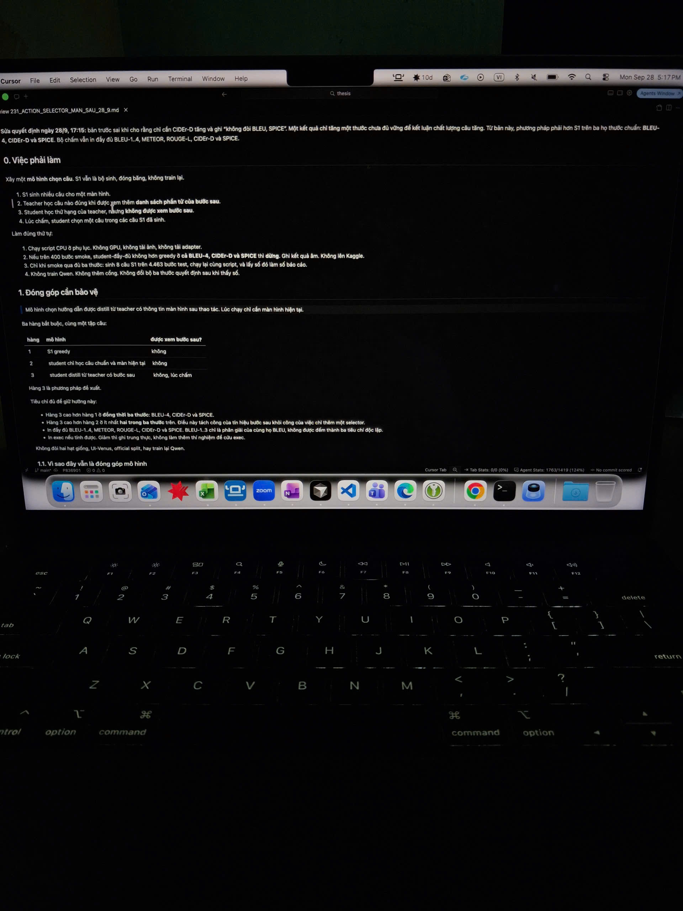
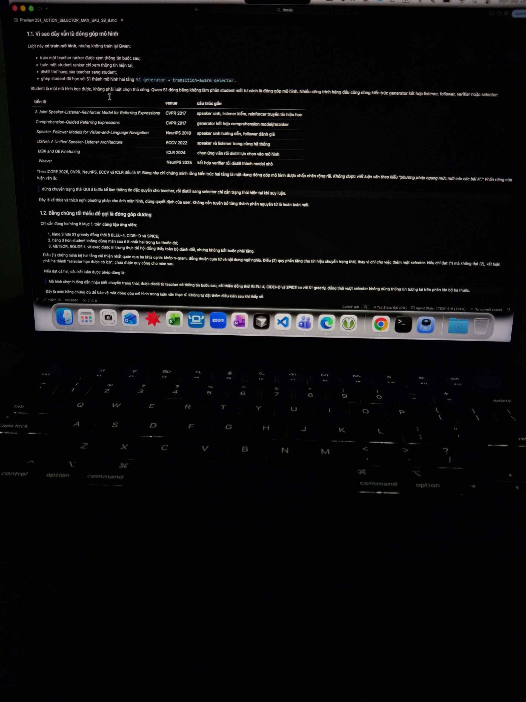
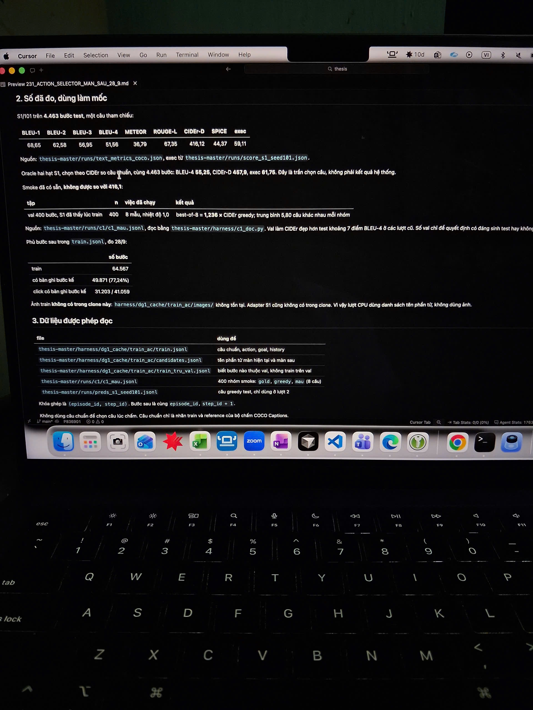
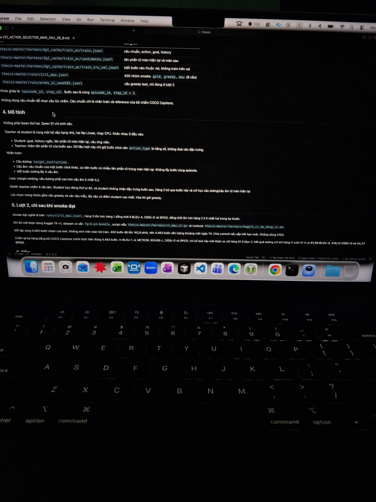

# ACTION SELECTOR — MÀN SAU 28/9

> Sửa quyết định ngày 28/9, 17:15: bản trước sai khi cho rằng chỉ cần CIDEr-D tăng và ghi “không đổi BLEU, SPICE”. Một kết quả chỉ tăng một thước chưa đủ vững để kết luận chất lượng câu tăng. Từ bản này, phương pháp phải hơn S1 trên ba thước chuẩn: BLEU-4, CIDEr-D và SPICE. Bộ chấm vẫn in đầy đủ BLEU-1..4, METEOR, ROUGE-L, CIDEr-D và SPICE.

## 0. Việc phải làm

Xây một mô hình chọn câu. S1 vẫn là bộ sinh, đóng băng, không train lại.

1. S1 sinh nhiều câu cho một hình.
2. Teacher học câu nào đúng khi được xem thêm danh sách phần tử của bước sau.
3. Student học thứ hạng của teacher, nhưng không được xem bước sau.
4. Lúc chấm, student chọn một câu trong các câu S1 đã sinh.

Làm đúng thứ tự:

1. Chạy script CPU ở phụ lục. Không GPU, không tải ảnh, không tải adapter.
2. Nếu trên 400 bước smoke, student-đầy-đủ không hơn greedy cả BLEU-4, CIDEr-D và SPICE thì dừng. Ghi kết quả âm. Không lên Kaggle.
3. Chỉ khi smoke qua đủ ba thước: sinh 8 câu S1 trên 4.463 bước test, chạy lại cùng script, và lấy số đó làm số báo cáo.
4. Không train Qwen. Không thêm cổng. Không đổi bộ ba thước quyết định sau khi thấy số.

## 1. Đóng góp cần bảo vệ

> Mô hình chọn hướng dẫn được distill từ teacher có thông tin màn hình sau thao tác. Lúc chạy chỉ cần màn hình hiện tại.

Ba hàng bắt buộc, cùng một tập câu:

| Hàng | Mô hình | Được xem bước sau? |
|---:|---|---|
| 1 | S1 greedy | Không |
| 2 | Student chỉ học câu chuẩn và màn hiện tại | Không |
| 3 | Student distill từ teacher có bước sau | Không, lúc chấm |

Hàng 3 là phương pháp đề xuất.

Tiêu chí đủ để giữ hướng này:

- Hàng 3 cao hơn hàng 1 ở đồng thời ba thước: BLEU-4, CIDEr-D và SPICE.
- Hàng 3 cao hơn hàng 2 ở ít nhất hai trong ba thước trên. Điều này tách công của tín hiệu bước sau khỏi công việc chỉ thêm một selector.
- In đầy đủ BLEU-1..4, METEOR, ROUGE-L, CIDEr-D và SPICE. BLEU-1..3 chỉ là phần giải cứu công bố BLEU, không được đếm thành ba tiêu chí độc lập.
- In `exec` nếu tính được. Giảm thì ghi trung thực, không làm thêm thí nghiệm để cứu `exec`.

Không đổi lại hạt giống, UI-Venus, official split, hay train lại Qwen.

### 1.1. Vì sao đây vẫn là đóng góp mô hình

Lượt này có train mô hình, nhưng không train lại Qwen:

- Train một teacher ranker được xem thông tin bước sau.
- Train một student ranker chỉ xem thông tin hiện tại.
- Distill thứ hạng của teacher sang student.
- Ghép student đã học với S1 thành mô hình hai tầng: **S1 generator → transition-aware selector**.

Student là một mô hình học được, không phải luật chọn thủ công. Qwen S1 đóng băng không làm phần student mất tư cách là đóng góp mô hình. Nhiều công trình hàng đầu cũng dùng kiến trúc generator kết hợp listener, follower, verifier hoặc selector:

| Tiền lệ | Venue | Cấu trúc gần |
|---|---|---|
| *A Joint Speaker-Listener-Reinforcer Model for Referring Expressions* | CVPR 2017 | Speaker sinh, listener kiểm, reinforcer truyền tín hiệu học |
| *Comprehension-Guided Referring Expressions* | CVPR 2017 | Generator kết hợp comprehension model/reranker |
| *Speaker-Follower Models for Vision-and-Language Navigation* | NeurIPS 2018 | Speaker sinh hướng dẫn, follower đánh giá |
| *D3Net: A Unified Speaker-Listener Architecture* | ECCV 2022 | Speaker và listener trong cùng hệ thống |
| *MBR and QE Finetuning* | ICLR 2024 | Chọn ứng viên rồi distill lựa chọn vào mô hình |
| *Weaver* | NeurIPS 2025 | Kết hợp verifier rồi distill thành model nhỏ |

Theo ICORE 2026, CVPR, NeurIPS, ECCV và ICLR đều là A*. Bảng này chỉ chứng minh rằng kiến trúc hai tầng là một dạng đóng góp mô hình được chấp nhận rộng rãi. Không được viết luận văn theo kiểu “phương pháp ngang mức mới của các bài A*”. Phần riêng của luận văn là:

> Dùng chuyển trạng thái GUI ở bước kế làm thông tin đặc quyền cho teacher, rồi distill sang selector chỉ cần trạng thái hiện tại khi suy luận.

Đây là kế thừa và thích nghi phương pháp cho ảnh màn hình, đúng quyết định của user. Không cần tuyên bố từng thành phần nguyên tử là hoàn toàn mới.

### 1.2. Bằng chứng tối thiểu để gọi là đóng góp dương

Chỉ cần đúng ba hàng ở Mục 1, trên cùng tập ứng viên:

1. Hàng 3 hơn S1 greedy đồng thời ở BLEU-4, CIDEr-D và SPICE.
2. Hàng 3 hơn student không dùng màn sau ở ít nhất hai trong ba thước đó.
3. METEOR, ROUGE-L và `exec` được in trung thực để hội đồng thấy toàn bộ đánh đổi, nhưng không bắt buộc phải tăng.

Điều (1) chứng minh hệ hai tầng cải thiện nhất quán qua ba khía cạnh: khớp n-gram, đồng thuận cụm từ và nội dung ngữ nghĩa. Điều (2) quy phần tăng cho tín hiệu chuyển trạng thái, thay vì chỉ cho việc thêm một selector. Nếu chỉ đạt (1) mà không đạt (2), kết luận phải hạ thành “selector học được có ích”; chưa được quy công cho màn sau.

Nếu đạt cả hai, câu kết luận được phép dùng là:

> Mô hình chọn hướng dẫn nhận biết chuyển trạng thái, được distill từ teacher có thông tin bước sau, cải thiện đồng thời BLEU-4, CIDEr-D và SPICE so với S1 greedy, đồng thời vượt selector không dùng thông tin tương lai trên phần lớn bộ ba thước.

Đây là mức bằng chứng đủ để bảo vệ một đóng góp mô hình trong luận văn thực nghiệm. Không tự đặt thêm điều kiện sau khi thấy số.

## 2. Số đã đo, dùng làm mốc

S1/101 trên **4.463 bước test**, một câu tham chiếu:

| BLEU-1 | BLEU-2 | BLEU-3 | BLEU-4 | METEOR | ROUGE-L | CIDEr-D | SPICE | exec |
|---:|---:|---:|---:|---:|---:|---:|---:|---:|
| 68,65 | 62,58 | 56,95 | 51,56 | 36,79 | 67,35 | 416,12 | 44,37 | 59,11 |

Nguồn: `thesis-master/runs/text_metrics_coco.json`, `exec` từ `thesis-master/runs/score_s1_seed101.json`.

Oracle hai bất S1, chọn theo CIDEr so câu chuẩn, cùng 4.463 bước: BLEU-4 **56,25**, CIDEr-D **457,9**, `exec` **61,75**. Đây là trần chọn câu, không phải kết quả hệ thống.

Smoke đã có sẵn, không được so với 416,1:

| Tập | n | Việc đã chạy | Kết quả |
|---|---:|---|---|
| Val 400 bước, S1 đã thấy lúc train | 400 | 8 mẫu, nhiệt độ 1,0 | best-of-8 = **1,236 × CIDEr greedy**; trung bình **5,80 câu khác nhau mỗi nhóm** |

Nguồn: `thesis-master/runs/c1/c1_mau.jsonl`, đọc bằng `thesis-master/harness/c1_doc.py`. Val làm CIDEr đẹp hơn test khoảng 7 điểm BLEU-4 ở các lượt cũ. Số val chỉ để quyết định có đáng sinh test hay không.

Phủ bước sau trong `train.jsonl`, đo 28/9:

| | Số bước |
|---|---:|
| Train | 64.567 |
| Có bản ghi bước kế | 49.871 (77,24%) |
| Click có bản ghi bước kế | 31.203 / 41.059 |

Ảnh train không có trong clone này: `harness/dg1_cache/train_ac/images/` không tồn tại. Adapter S1 cũng không có trong clone. Vì vậy lượt CPU dùng danh sách tên phần tử, không dùng ảnh.

## 3. Dữ liệu được phép đọc

| File | Dùng để |
|---|---|
| `thesis-master/harness/dg1_cache/train_ac/train.jsonl` | Câu chuẩn, action, goal, history |
| `thesis-master/harness/dg1_cache/train_ac/candidates.jsonl` | Tên phần tử màn hiện tại và màn sau |
| `thesis-master/harness/dg1_cache/train_ac/train_tru_val.jsonl` | Biết bước nào thuộc val, không train trên val |
| `thesis-master/runs/c1/c1_mau.jsonl` | 400 nhóm smoke: `gold`, `greedy`, `mau` (8 câu) |
| `thesis-master/runs/preds_s1_seed101.jsonl` | Câu greedy test, chỉ dùng ở lượt 2 |

Khóa ghép là `(episode_id, step_id)`. Bước sau là cùng `episode_id`, `step_id + 1`.

Không dùng câu chuẩn để chọn câu lúc chấm. Câu chuẩn chỉ là nhãn train và reference của bộ chấm COCO Captions.

## 4. Mô hình

Không phải Qwen thứ hai. Qwen S1 chỉ sinh câu.

Teacher và student là cùng một bộ xếp hạng nhỏ, hai lớp Linear, chạy CPU. Khác nhau ở đầu vào:

- **Student:** goal, history ngắn, tên phần tử màn hiện tại, câu ứng viên.
- **Teacher:** thêm tên phần tử của bước sau. Dữ liệu lượt này chỉ giữ bước click nên `action_type` là hằng số, không đưa vào đặc trưng.

Nhãn train:

- Câu dương: `target_instruction`.
- Câu âm: câu chuẩn của một bước click khác, ưu tiên bước có nhiều tên phần tử trùng màn hiện tại. Không lấy bước cùng episode.
- Mỗi bước dùng lấy 4 câu âm.

Loss: margin ranking, câu dương phải cao hơn câu âm ít nhất 0,2.

Distill: teacher chấm 4 câu âm. Student học đúng thứ tự đó, và student không nhận đặc trưng bước sau. Hàng 2 bỏ qua bước này và chỉ học câu dương/câu âm từ màn hiện tại.

Lúc chọn: trong nhóm gồm câu greedy và các câu mẫu, lấy câu có điểm student cao nhất. Hòa thì giữ greedy.

## 5. Lượt 2, chỉ sau khi smoke đạt

Smoke đạt nghĩa là trên `runs/c1/c1_mau.jsonl`, hàng 3 lớn hơn hàng 1 đồng thời ở BLEU-4, CIDEr-D và SPICE, đồng thời lớn hơn hàng 2 ở ít nhất hai trong ba thước.

Khi đó mới được dùng Kaggle T4 ×1, dataset có sẵn `fgrb-p1-bundle`, script mẫu `thesis-master/harness/c1_mau_s1.py` và runbook `thesis-master/harness/runbook/kaggle_c1_da_dang_s1.md`.

Đổi tập sang 4.463 bước chấm của test. Không sinh trên toàn bộ train. 400 bước đã tốn 142,9 phút, nên 4.463 bước ước lượng khoảng một ngày T4. Chia commit nếu sắp hết hạn mức. Không dùng A100.

Chấm tại ba hàng bằng bộ COCO Captions chính thức trên đúng 4.463 bước. In BLEU-1..4, METEOR, ROUGE-L, CIDEr-D và SPICE; chỉ số test này mới được so với hàng S1 ở Mục 2. Kết quả dương chỉ khi hàng 3 vượt S1 ở cả **51,56 BLEU-4**, **416,12 CIDEr-D** và **44,37 SPICE**.

## Ảnh nguồn

1. 
2. 
3. 
4. `